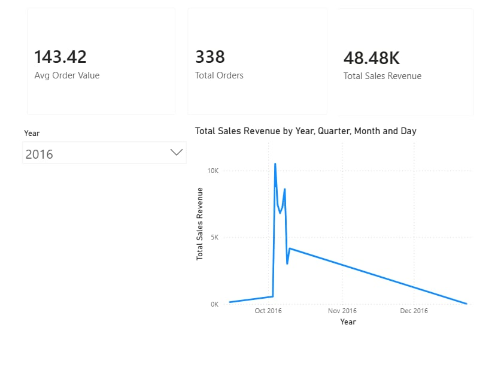
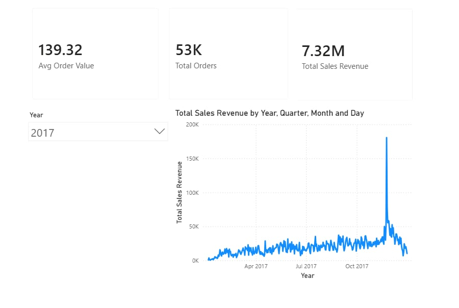
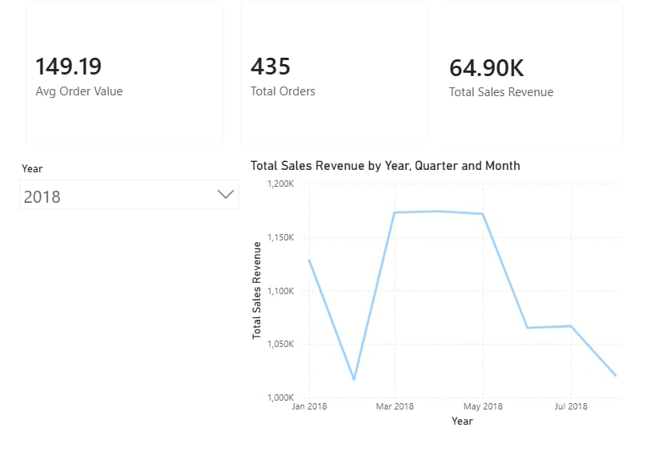

# E-Commerce Sales Performance Dashboard

A simple interactive business intelligence dashboard that tracks monthly revenue trends, order volumes, and key sales performance metrics using raw e-commerce data.

### Dashboard Preview

---

### What It Tracks
* **Key Performance Indicators (KPIs):** Total Revenue, Total Orders, and Average Order Value (AOV).

---

## Tech Stack
* **Database Server:** PostgreSQL
* **Query Language:** SQL (Staging views and relational logic)
* **BI Software:** Power BI Desktop
* **Formula Language:** DAX (Custom business performance metrics)

---

## Dataset Source
The data used in this project is the real-world **Olist Brazilian E-Commerce dataset** from Kaggle, containing historical relational data across multiple tables.
